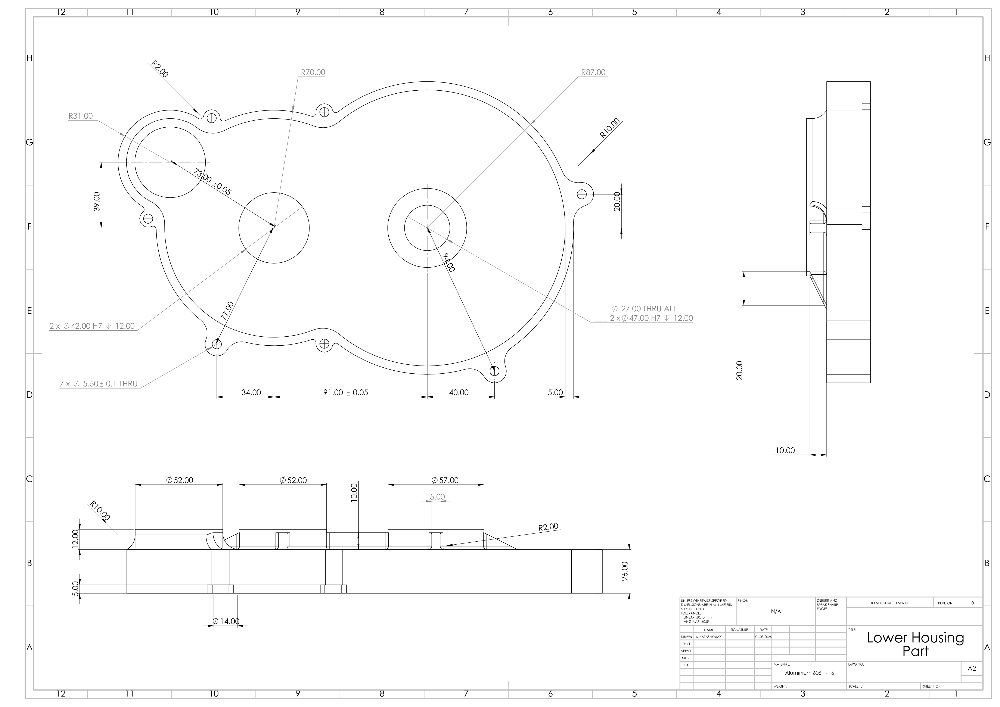
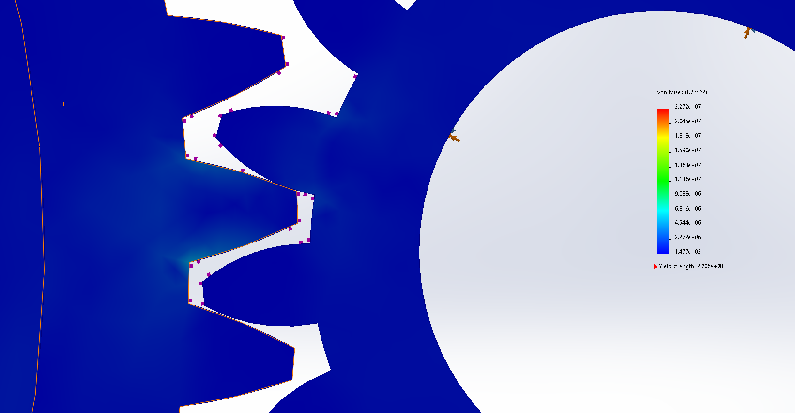
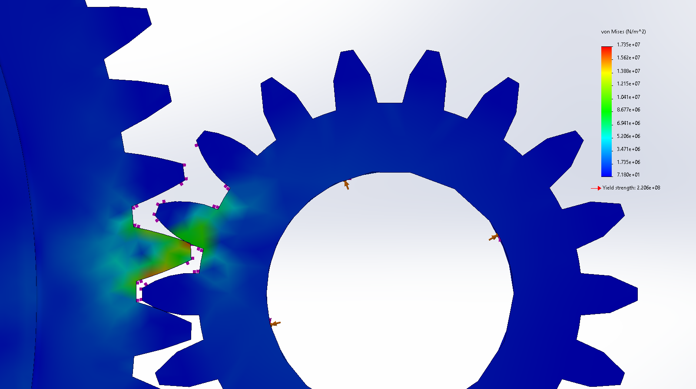

# Project Overview
This project was developed as a portfolio engineering case study to demonstrate practical CAD design skills, mechanical reasoning and the ability to create employer-relevant engineering documentation.
The purpose of this project is not only to show a 3D model, but to demonstrate the practical value I can bring as an employee: designing mechanical parts, creating structured CAD assemblies, preparing technical drawings, documenting design assumptions, organizing a bill of materials and communicating engineering decisions clearly.
Used software: SOLIDWORKS

Below is the kinematic demonstration of the gearbox, with initial pinion speed of 100rpm

Below is one of the screenshots, which demonstrates the exploded view of the gearbox

Below is one of the blueprints, which demonstrates the technical drawing of lower housing part

# Technical Notice
1. Actual bearings were replaced to the simplified bearing placeholders based on standard envelope dimensions
2. Material is assigned for CAD visualization only. Final material selection was not part of this study.
3. Actual ratio of the gearbox is 13.36:1, which gives 2.77% deviation from the target ratio
4. Normal internal clearance, standard precision and concept-level material assumptions were used.
5. Tight-fit for housing fastener bolts was assumed
6. Lubrication assumption: Lithium-EP 2

# BOM (Bill Of Materials)
| Item No. | Part Name | File Name | Qty. | Category | Material / Assumption | Notes |
|---:|---|---|---:|---|---|---|
| 1 | Lower housing part | `lower_part.SLDPRT` | 1 | Custom designed part | Aluminum 6061-T6 / aluminum alloy | Lower half of split gearbox housing |
| 2 | Upper housing part | `upper_part.SLDPRT` | 1 | Custom designed part | Aluminum 6061-T6 / aluminum alloy | Upper half of split gearbox housing |
| 3 | Gear A / input pinion, 17T | `gear_a.SLDPRT` | 1 | Custom gear | C45 steel / AISI 1045 steel | First-stage driving pinion, module 2 |
| 4 | Gear B / first-stage driven gear, 56T | `gear_b.SLDPRT` | 1 | Custom gear | C45 steel / AISI 1045 steel | First-stage driven gear, module 2 |
| 5 | Gear C / second-stage pinion, 18T | `gear_c.SLDPRT` | 1 | Custom gear | C45 steel / AISI 1045 steel | Second-stage driving pinion, module 2 |
| 6 | Gear D / output gear, 73T | `gear_d.SLDPRT` | 1 | Custom gear | C45 steel / AISI 1045 steel | Second-stage output gear, module 2 |
| 7 | Output shaft | `output_shaft.SLDPRT` | 1 | Custom shaft | C45 steel / AISI 1045 steeld | Supports output gear and transmits output torque |
| 8 | Output shaft spacer tube | `output_shaft_stopper_tube.SLDPRT` | 1 | Custom spacer | C45 steel / AISI 1045 steel | Axial positioning component |
| 9 | Third gear shaft spacer tube | `a_gear_shaft_stopper_tube.SLDPRT` | 1 | Custom spacer | C45 steel / AISI 1045 steel | Axial positioning component for intermediate shaft |
| 10 | Bearing placeholder 6004 | `cosmetic_bearing_20-42-12.SLDPRT` | 4 | Simplified standard component | Bearing steel | Standard envelope: 20×42×12 mm, CN |
| 11 | Bearing placeholder 6005 | `cosmetic_bearing_25-47-12.SLDPRT` | 4 | Simplified standard component | Bearing steel | Standard envelope: 25×47×12 mm, CN |
| 12 | Retaining ring for 20 mm shaft, DIN471 | `retaining_ring_1.SLDPRT` | 4 | Simplified standard component | Spring steel | Used for axial retention |
| 13 | Retaining ring for 25 mm shaft, DIN 471 | `retaining_ring_2.SLDPRT` | 2 | Simplified standard component | Spring steel | Used for axial retention |
| 14 | M5 hex head bolt | | 7 | Standard hardware | Steel, class 8.8, zinc-plated | Used to fasten upper and lower housing parts |
| 15 | M5 washer | |14 | Standard hardware | Steel, zinc-plated | Optional washer under bolt head |
| 16 | M5 hex nut | | 7 | Standard hardware | Steel, class 8.8,  zinc-plated | Required if the lower housing is not threaded |

# FEM-Studies
A simplified static FEM study was performed to visualize stress concentration in the gear tooth contact regions.

Below is one of the screenshots, which demonstrates the local tooth - stress conecetration for the first stage of the gearbox

Below is one of the screenshots, which demonstrates the local tooth-stress conecetration for the second stage of the gearbox

The full-view screenshots with the results of FEM-study for both of the stage can be found in './screenshots' folder. They include stress-concentration, displacement and strain.

| FEM Case | Load setup | Max von Mises | Yield strength | Safety Factor (FoS) |
|---|---|---|---|---|
| Stage 1 | 1 $N\cdot m$ torque on Gear A, Gear B constrained | 22.7 MPa | 220.6MPa | 9.7 |
| Stage 2 | 3.13 $N\cdot m$ torque on Gear C, Gear D constrained | 17.4 MPa | 220.6 MPa | 12.7 |

It was assumed the input torque 1 $N\cdot m$ on Gear A, so that in the second stage the Gear C has torque approx 3.13 $N\cdot m$.
According to this study, the maximal input torque could be  9.7 $N\cdot m$.
Below is the table of different possible input torques and safety levels

| Safety Factor (FoS) | Input Torque |
| --- | --- |
| FoS 1.0 | 9.7 $N\cdot m$ |
| FoS 1.5 | 6.5 $N \cdot m$ |
| FoS 2.0 | 4.85 $N \cdot m$ |
| FoS 3.0 | 3.2 $N\cdot m$|
| FoS 5.0| 1.9 $N \cdot m

These FEM studies are simplified static torque/contact checks

# Bearings information
The bearing geometry in this project is simplified and used as placeholder geometry for CAD layout purposes.
The selected envelope dimensions correspond to standard deep groove ball bearings:
1. 6004: 20×42×12 mm
2. 6005: 25×47×12 mm

# Calculations
Gear ratio:
- Stage 1: 56 / 17 = 3.294
- Stage 2: 73 / 18 = 4.056
- Total ratio: 3.294 $\cdot$ 4.056 = 13.36:1
- Deviation from target 13:1 = +2.77%

Pitch diameter:
- $dA = 2 \cdot 17 = 34$ mm
- $dB = 2 \cdot 56 = 112$ mm
- $dC = 2 \cdot 18 = 36$ mm
- $dD = 2 \cdot 73 = 146$ mm

Center distances:
- $a_1 = \frac{dA + dB}{2} = \frac{34 + 112}{2} = 73$ mm
- $a_2 = \frac{dC + dD}{2} = \frac{36 + 146}{2} = 91$ mm

Output speed:
- $n_{out} = 100 / 13.36 = 7.485$ rpm

Simplified tangential tooth load estimation:
Assumption of Input Torque as $1Nm$
- $F_{tA} = 2 \cdot 1 / 0.034 = 58.8$ N
- $T_{intermediate} = 1 \cdot 3.294 \cdot 0.95 = 3.13$ Nm
- $F_{tC} = 2 × 3.13 / 0.036 = 173.9$ N

Radial gear force estimation:
- $F_{rA} = 58.8 \cdot tan(20°) = 21.4$ N
- $F_{rC} = 173.9 \cdot tan(20°) = 63.3$ N

Bearing reaction estimation (for the second stage):
- $F_{res} = (173.9² + 63.3²)^{1/2} = 185.1$ N

# Gears Info
Dimension are specified in mm and deg

Gear A (pinion):
1. No. of Teeth: 17
2. Module: 2
3. Pressure Angle: 20
4. Pitch diameter: 34
5. Outside diameter: 38
6. Root diameter: 29
7. Base diameter: 31.95
8. Face width: 15

Gear B:
1. No. of Teeth: 56
2. Module: 2
3. Pressure Angle: 20
4. Pitch diameter: 112
5. Outside diameter: 116
6. Root diameter: 107
7. Base diameter: 107
8. Face width: 15

Gear C:
1. No. of Teeth: 18
2. Module: 2
3. Pressure Angle: 20
4. Pitch diameter: 36
5. Outside diameter: 40
6. Root diameter: 31
7. Base diameter: 33.825
8. Face width: 15

Gear D:
1. No. of Teeth: 73
2. Module: 2
3. Pressure Angle: 20
4. Pitch diameter: 146
5. Outside diameter: 150
6. Root diameter: 140.98
7. Base diameter: 137.2
8. Face width: 15
